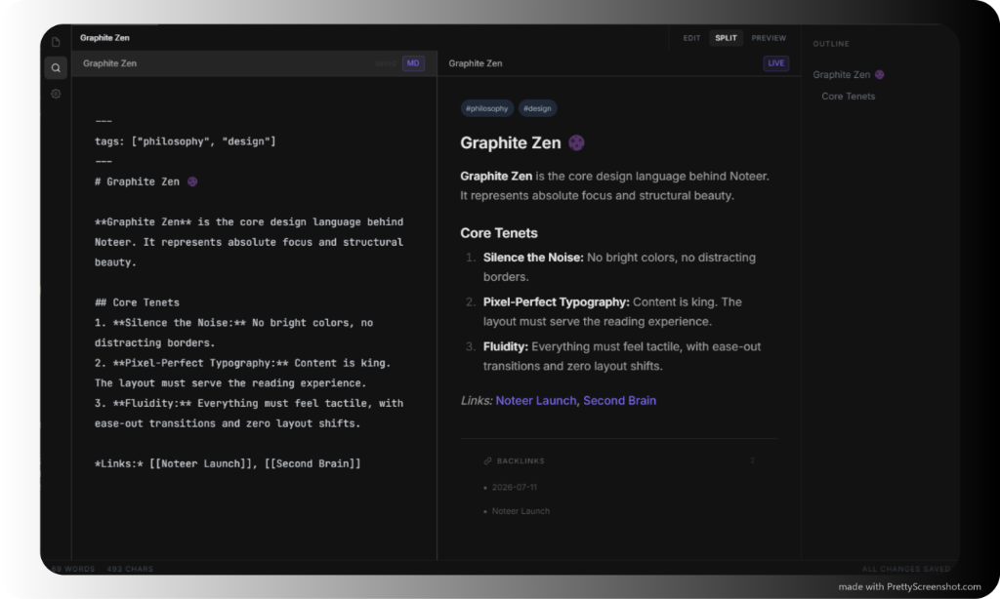
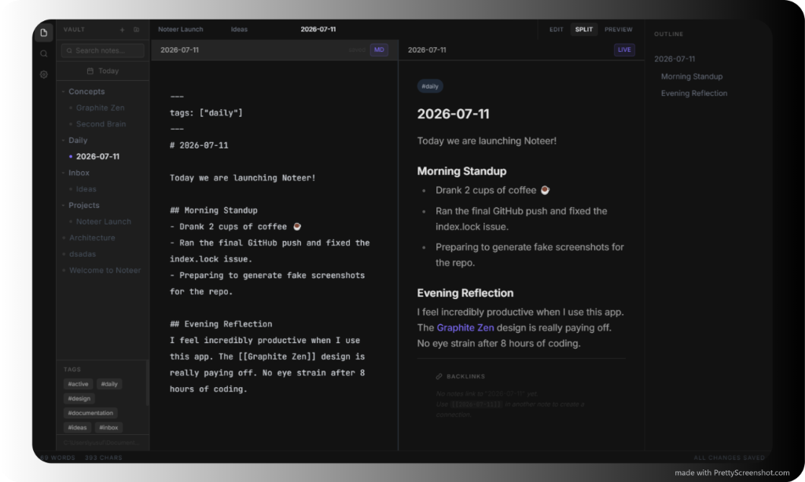
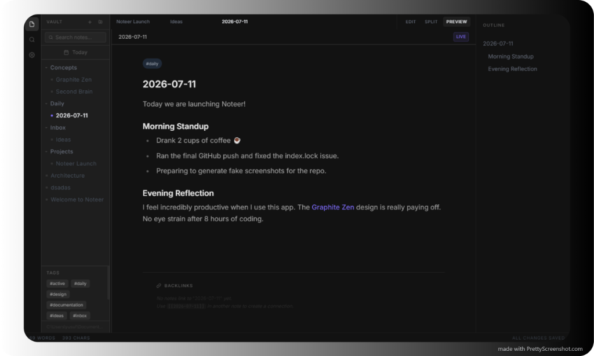
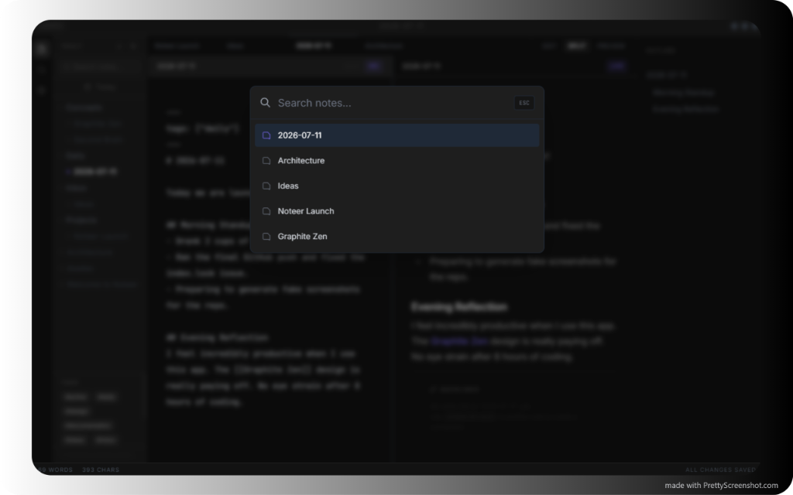

# Noteer

**Noteer** is a local-first, hyper-minimalist Markdown second-brain application. Designed as a distraction-free Obsidian alternative, Noteer gives you absolute ownership over your thoughts without the noise of bloated interfaces.

> [!WARNING]  
> **Pre-Alpha / Experimental Concept**  
> This project is currently in a very early **Pre-Alpha / Experimental Concept** stage. It is **not** ready for beta testing or daily production use. This is an active work-in-progress: layout bugs may exist, features are incomplete, and the entire architecture is subject to heavy, unannounced changes. Proceed with caution.

## 🖼 Showcase

Noteer is built around the "Graphite Zen" design philosophy—absolute minimal distraction, pixel-perfect typography, and structural beauty.


*Dual-pane editing with real-time preview and structural outline.*


*Frictionless daily journaling inside your local vault.*


*Manage multiple parallel contexts simultaneously with the buttery-smooth multi-tab interface.*


*Instantly search and jump between your notes using the `Ctrl+K` Command Palette overlay.*

---

## 🇬🇧 English

Noteer is built for those who want a serene, distraction-free environment to map their mind. It operates entirely locally, meaning your data never leaves your machine. 

### Core Features
- **Local Vault:** Your notes live on your machine as pure `.md` files. You have complete ownership.
- **Daily Notes:** A frictionless daily journaling engine. Just click "Today" and start writing.
- **Multi-Tab Workspace:** Open and manage multiple notes simultaneously with a buttery-smooth multi-tab interface.
- **Global Search:** Blazing fast, asynchronous full-text search across your entire vault.
- **Zen Mode:** Hide all UI elements with a single click and enter an immersive, distraction-free writing environment.
- **Graph View:** Visualize your second brain with an interactive, physics-based constellation of your linked thoughts and ideas.

### Installation (For Everyone)
1. Go to the [Releases](https://github.com/YusufAlisan53/noteer/releases) page on GitHub.
2. Download the latest `Noteer Setup.exe`.
3. Double click to install and run. (No coding knowledge required!)

---

## 🇹🇷 Türkçe

**Noteer**, yerel odaklı (local-first) ve dikkat dağıtmayan, hiper-minimalist bir İkinci Beyin (Second Brain) uygulamasıdır. Obsidian'a alternatif olarak geliştirilmiş olup, gereksiz karmaşadan uzak bir ortamda düşüncelerinizi haritalamanızı sağlar.

> [!WARNING]  
> **Pre-Alpha / Deneysel Konsept**  
> Bu proje şu anda çok erken bir **Pre-Alpha / Deneysel Konsept** aşamasındadır. Henüz beta testine veya günlük kullanıma hazır **değildir**. Aktif olarak geliştirilmektedir: arayüz hataları bulunabilir, bazı özellikler eksiktir ve tüm mimari herhangi bir bildirim olmaksızın köklü değişikliklere uğrayabilir. Lütfen kullanırken dikkatli olun.

### Temel Özellikler
- **Yerel Kasa (Local Vault):** Notlarınız sadece bilgisayarınızda saf `.md` dosyaları olarak saklanır. Verilerinizin tam kontrolü sizdedir.
- **Günlük Notlar (Daily Notes):** Sorunsuz bir günlük kayıt motoru. Sadece "Bugün" (Today) butonuna tıklayın ve yazmaya başlayın.
- **Sekmeli Yapı (Multi-Tab Workspace):** Akıcı ve çoklu sekme arayüzü ile aynı anda birden fazla notu kolayca yönetin.
- **Tam Metin Arama (Global Search):** Tüm kasanız içinde asenkron ve şimşek hızında arama yapın.
- **Odak Modu (Zen Mode):** Tek bir tıkla tüm arayüzü gizleyin ve tamamen dikkatinizin dağılmayacağı bir yazım ortamına girin.
- **Ağ Görünümü (Graph View):** Birbirine bağlı düşünce ve fikirlerinizi etkileşimli, fizik motoru tabanlı bir harita üzerinde görselleştirin.

### Kurulum (Geliştirici Olmayanlar İçin)
1. GitHub'daki [Releases](https://github.com/YusufAlisan53/noteer/releases) sayfasına gidin.
2. En son sürümdeki `Noteer Setup.exe` dosyasını indirin.
3. Çift tıklayıp kurun. (Hiçbir yazılım bilgisine veya ekstra programa gerek yoktur!)

---

## 🛠 Tech Stack

Noteer is proudly built on a modern, robust web stack:
- **Electron**
- **React**
- **TypeScript**
- **TailwindCSS**
- **Zustand**
- **react-force-graph-2d**

## 🚀 Setup & Run (For Developers)

To run the application locally in development mode:

```bash
# 1. Install dependencies
npm install

# 2. Run the Vite dev server and Electron app
npm run dev

# 3. Build the production executable
npm run build:app
```
